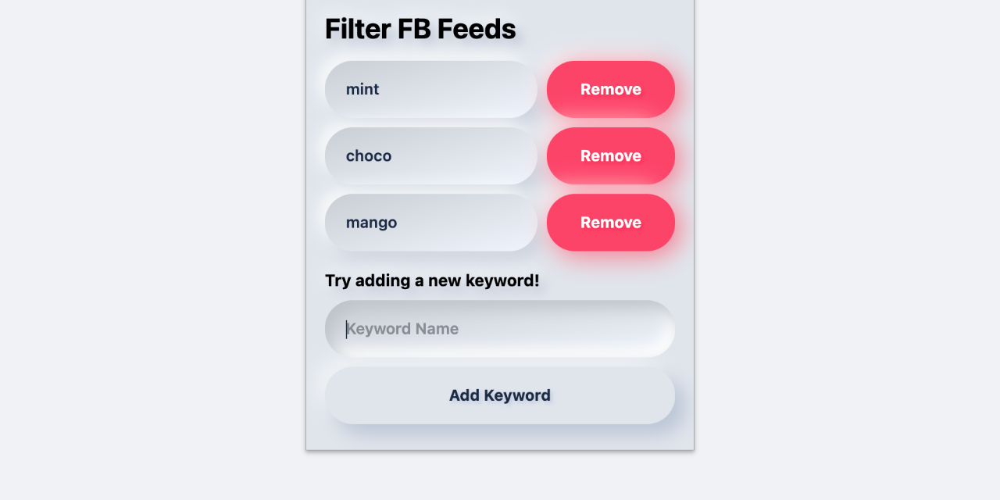
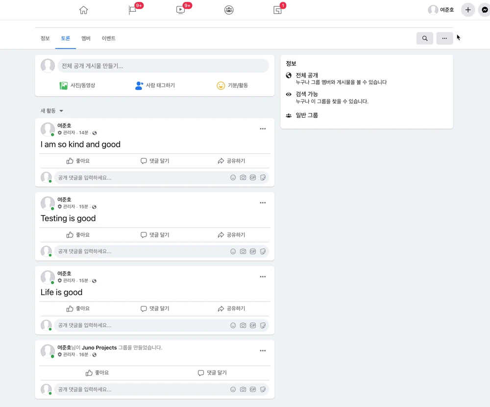

# Filter FB Feeds

Chrome Extension to hide feeds that contain **specific keywords** on [Facebook](https://www.facebook.com)

  
  <blockquote align="center">
    Preview for Extension popup
  </blockquote>

- Autofocus to input when popup opens
- Searches for new feeds on every page scoll

## 🚀 On action

  
  <blockquote align="center">
   <strong>(ﾉ>ω<)ﾉ</strong> Yay!
  </blockquote>

## 📦 Installation

1. Clone or download this repo
2. Go to the Chrome Extensions page(`chrome://extensions/`).
3. Enable **Developer mode** with the switch on the top right.
4. Load the downloaded folder where the `manifest.json` file exists.
5. Click the Facebook icon on the extensions bar, open the popup and start adding keywords!
